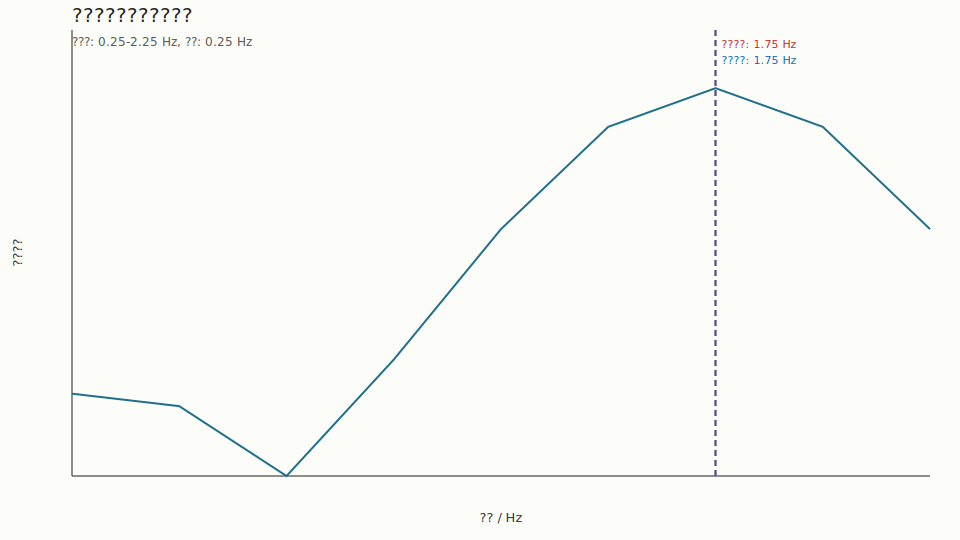

# ???????????

## 1. ????

?? `estimate_aid_frequency_phase` ???????????????????????????????

## 2. ????

- ????`400 Hz`
- ?????`1.0 s`
- ?????`1.75 Hz`
- ?????`-0.70 rad`
- ?????`1.25 Hz`
- ????`1.00 Hz`
- ???`0.25 Hz`

## 3. ??

- ?????`1.750000 Hz`
- ?????`-0.700000 rad`
- ?????`400.000000`
- ????????`1.750000 Hz`
- ????????????`0.000000 Hz`
- ????????????`0.000000 rad`

## 4. ?????

## 5. ??

?????????????????????????????????? aid ????????????