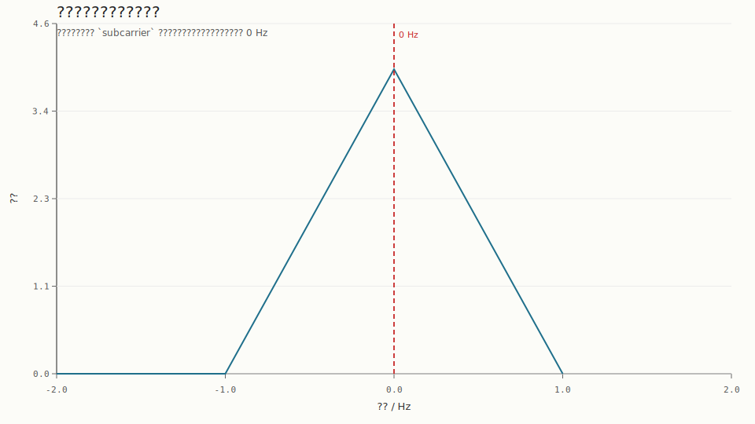

# ????????????

## 1. ????

???? `generate_aid_subcarrier` ????????????????????????????????????

## 2. ????

- ??????`8 Hz`
- ?????`4 Hz`
- ?????`1.0 s`
- ????????`2.0`
- ???????????? `0.2 * n`

## 3. ??

- ??????????`4`
- ????????`1.000000`
- ????????`0.000000`
- ??????????`0.000000`
- FFT ?????`0.000000 Hz`
- FFT ?????`4.000000`

## 4. ???

## 5. ??

????????????????? 1 ?????FFT ???? 0 Hz?????????????????