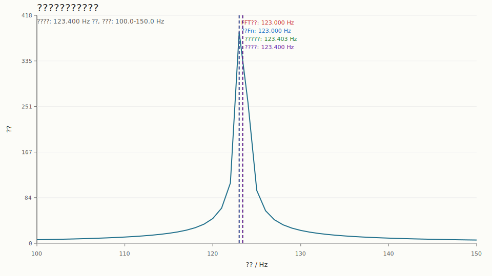

# ???????????

## 1. ????

???? `estimate_main_carrier_frequency` ?????????????? `Fn` ??? FFT ?????

## 2. ????

- ????`1024 Hz`
- ?????`1.0 s`
- ?????`123.400 Hz`
- FFT ???`1024`
- ????`100.0 Hz` ? `150.0 Hz`

## 3. ??

- FFT ????????`123.000 Hz`
- FFT ?????`387.368260`
- ???? `Fn`?`123.000 Hz`
- ????????`123.402745 Hz`
- ??????????`0.400 Hz`
- ????????`0.000 Hz`

## 4. ???

## 5. ??

??????FFT ????????????? `Fn` ??????????????????????????????????????????????? PLL ????????