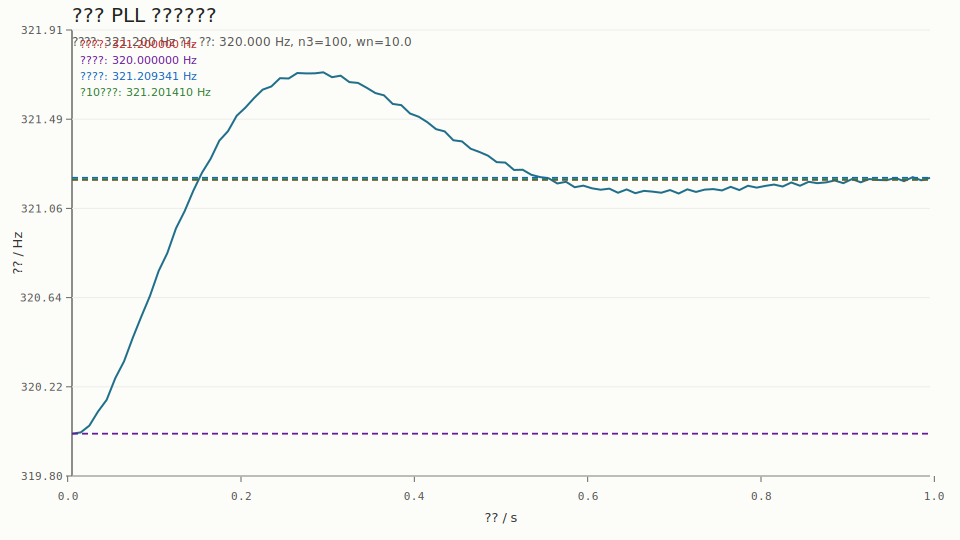

# ??? PLL ??????

## 1. ????

???? `track_main_carrier_pll` ??????????????????????????????

## 2. ????

- ????`2000 Hz`
- ?????`1.0 s`
- ?????`321.200 Hz`
- ?????`320.000 Hz`
- ?????`100`
- ???? `wn`?`10.0`

## 3. ??

- ???????`321.209341 Hz`
- ? 10 ??????`321.201410 Hz`
- ???????`0.009341 Hz`
- ? 10 ??????`0.001410 Hz`
- ?????????`1.200000 Hz`

## 4. ????

## 5. ??

??????PLL ?????????????????????????????????????????????????????